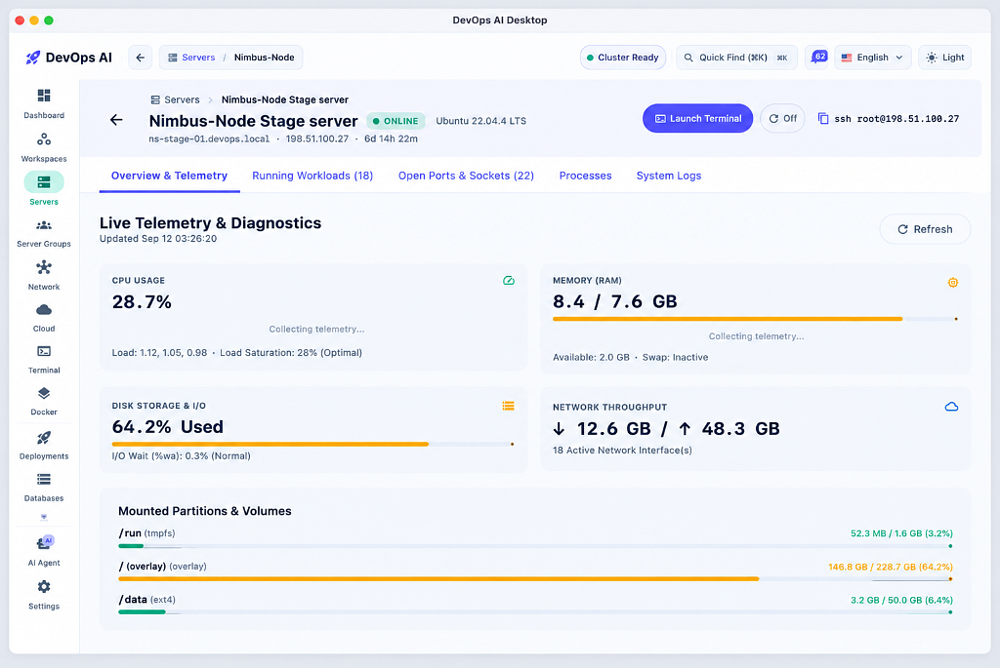

# DevOps AI — Autonomous Desktop Control Plane for Linux Infrastructure

Stop babysitting your servers. DevOps AI monitors your entire VPS fleet in real time, autonomously detects and resolves production incidents, orchestrates Docker, manages Nginx SSL, and executes zero-downtime blue/green deployments — all from your desktop.

Local-first. No agents. No cloud sync. Available for Windows, macOS, and Linux. Free during Public Beta.

  
  
  

  

## Light Mode Preview

## Features

- **Autonomous SRE & Self-Healing** — Detects OOM events, Nginx 502/504s, and daemon crashes. Executes risk-gated playbooks: disk cleanup, pagecache flush, container restarts.
- **Security Posture & Linux Hardening** — Weighted 6-category audit (SSH, UFW, TLS, Docker, packages, secrets) with 1-click hardening, Fail2ban, and HSTS.
- **Zero-Downtime Blue/Green CI/CD** — Dual slots (`app-blue` / `app-green`), 3× HTTP health probes, atomic Nginx reload with zero dropped connections. Git + HMAC webhooks.
- **Docker Fleet & Container Orchestration** — Live CPU/RAM meters, real-time log streaming, 1-click start/stop/restart/kill, image pruning and build-cache cleanup.
- **Nginx Reverse Proxy & SSL Automation** — GUI virtual hosts, proxy pass, WebSocket, caching, Certbot Let's Encrypt issuance with `nginx -t` pre-flight checks.
- **Database Provisioning & Disaster Recovery** — 1-click Postgres/MySQL, scheduled compressed dumps, offsite sync to S3 / R2 / B2, retention pruning, 1-click restore.
- **Live Telemetry & Fleet Monitoring** — CPU, RAM, disk, network sparklines, load average, swap, uptime, systemd manager, 5-minute fleet reachability checks.
- **Interactive Terminal & SFTP File Manager** — Full PTY shell, breadcrumb SFTP browser, in-app text editor with remote save, DevOps snippets catalog.
- **Multi-Env Secrets Vault & .env Manager** — Production / Staging / Preview scopes, AES-256-GCM encryption, masking, bulk `.env` import, versioned history with rollback.
- **Network Intelligence & Topology** — Internet → DNS → Nginx → Docker → DB hop view, UFW rule editor, TCP/HTTP/DNS diagnostics, NAT and port discovery.
- **Health Probes & Incident Response** — HTTP/HTTPS/TCP checks, latency histograms, uptime %, SSL expiry alerts, risk-classified incident log.
- **Automation Scheduler & Cron Manager** — Visual 5-field crontab editor with presets, manual triggers, stdout/stderr history, AI Copilot for natural-language automation.

## How It Works

1. **Download the desktop app** — Single native installer for Windows, macOS, and Linux.
2. **Connect via SSH key** — Enter server IP and private key. Encrypted locally with AES-256-GCM, never leaves your machine.
3. **Instant control** — AI auto-discovers containers, Nginx proxies, firewall rules, and telemetry in seconds.

100% local-first: credentials and SSH keys stay on your device. Zero cloud accounts, telemetry, or trackers.

## Developer

### Mehedi Hassan Piash
**Founder & Lead Engineer, PLabs**

Local-first security · Autonomous SRE · Production Linux ops

*Direct line to the person shipping DevOps AI — no support queue, no middlemen.*

## Contact

**Direct line to the builder — beta help, feedback & bug reports. Response within 24h during Public Beta.**

 

© 2026 PLabs. All rights reserved.
